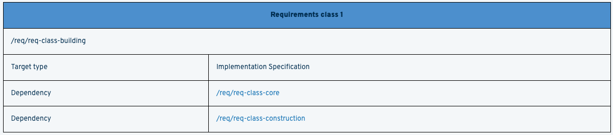
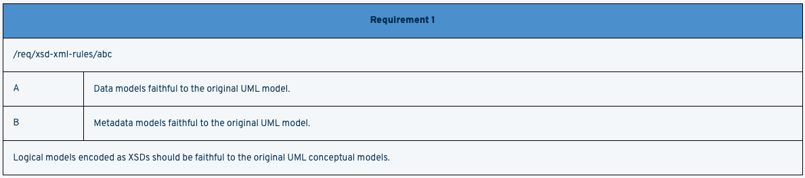
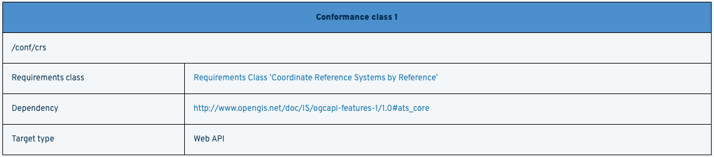
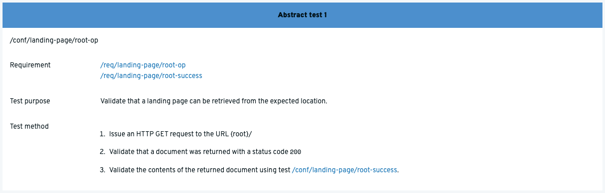

= Cheatsheet for Authoring OGC Documents using Metanorma

== Overview

This document presents tips and tricks for creating OGC documents using metanorma asciidoc. The document is a supplement to https://www.metanorma.org/author/ogc/authoring-guide/[official metanorma authoring guide for OGC documents].

== Migrating from Asciidoctor to Metanorma OGC Templates

The following table provides a cheatsheet that compares ascidoctor ascidoc to metanorma ascidoc.

[cols="1,1,1"]
|===

|feature
|ascidoctor
|metanorma

|Document metadata (e.g. docnumber, keywords, etc)
|Added as values in table cells
|Added as document attributes https://www.metanorma.org/author/ogc/authoring-guide/metadata/[(More info)]

|Requirements Classes
|Presentation and content specified as tables
|Created using a definition list, and then automatically rendered as tables. https://www.metanorma.org/author/ogc/topics/requirements/#reqt_class[(More info)]

|Requirements
|Presentation and content specified as tables
|Created using a definition list, and then automatically rendered as tables. https://www.metanorma.org/author/ogc/topics/requirements/#generalreqt[(More info)]

|Conformance Classes
|Presentation and content specified as tables
|Created using a definition list, and then automatically rendered as tables. https://www.metanorma.org/author/ogc/topics/requirements/#conformance-class[(More info)]

|Conformance Tests
|Presentation and content specified as tables
|Content added as  a definition list, and then automatically rendered as tables for Presentation. https://www.metanorma.org/author/ogc/topics/requirements/#conftest[(More info)]

|===

The following are examples of the features listed on the table above, encoded in metanorma asciidoc.

=== Document metadata

Metadata about the document is provided using document attributes. An example of document metadata is shown below.

[source,asciidoc]
----
= OGC API - Processes - Part 1: Core
:doctype: standard
:docsubtype: implementation
:edition: 1.0.0
:language: en
:docnumber: 18-062r2
:status: published
:copyright-year: 2021
:external-id: http://www.opengis.net/doc/IS/ogcapi-processes-1/1.0
:received-date: 2021-06-18
:issued-date: 2021-08-23
:published-date: 2021-12-09
:fullname: Benjamin Pross
:fullname_2: Panagiotis (Peter) A. Vretanos
:keywords: ogcdoc, OGC document, OGC API, Geospatial API, processes, Web Processing Service, WPS, JSON, HTML, geoprocessing, API, OpenAPI, HTML
:submitting-organizations: 52°North GmbH; Hexagon; CubeWerx Inc.; Ecere Corporation; Terradue Srl; European Space Agency (ESA); Spacebel
:local-cache-only:
:data-uri-image:
:mn-document-class: ogc
:mn-output-extensions: rxl,xml,html,pdf
----

=== Requirements Classes

An example of a Requirements Class, documented using a definition list, is shown below.

[source,asciidoc]
----
[requirements_class]
====
[%metadata]
label:: /req/req-class-building
subject:: Implementation Specification
inherit:: <<rc_core,/req/req-class-core>>
inherit:: <<rc_construction,/req/req-class-construction>>
====
----

The example above is rendered as shown below.

=== Requirements

An example of a Requirement, documented using a definition list, is shown below.

[source,asciidoc]
----
[requirement]
====
[%metadata]
label:: /req/xsd-xml-rules/abc
part:: Data models faithful to the original UML model.
part:: Metadata models faithful to the original UML model.
description:: Logical models encoded as XSDs should be faithful to the original
UML conceptual models.
====
----

The example above is rendered as shown below.

=== Conformance Classes

An example of a Conformance Class, documented using a definition list, is shown below.

[source,asciidoc]
----
[conformance_class]
====
[%metadata]
label:: /conf/crs
subject:: <<rc_crs,Requirements Class 'Coordinate Reference Systems by Reference'>>
inherit:: http://www.opengis.net/doc/IS/ogcapi-features-1/1.0#ats_core
classification:: Target Type:Web API
====
----

The example above is rendered as shown below.

=== Conformance Tests (Abstract Tests)

[source,asciidoc]
----
[abstract_test]
====
[%metadata]
label:: /conf/landing-page/root-op
subject:: <<req_landing-page_root-op,/req/landing-page/root-op>> +
<<req_landing-page_root-success,/req/landing-page/root-success>>
test-purpose:: Validate that a landing page can be retrieved from the expected location.
test-method::
+
--
. Issue an HTTP GET request to the URL {root}/
. Validate that a document was returned with a status code `200`
. Validate the contents of the returned document using test <<ats_landing-page_root-success,/conf/landing-page/root-success>>.
--
====
----

The example above is rendered as shown below.

